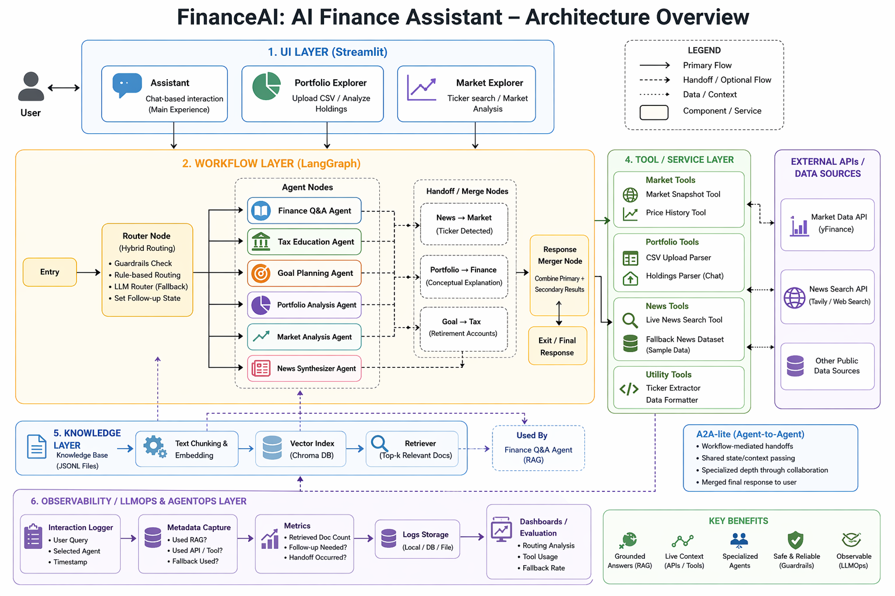

## Architecture Overview

The system is organized into five main layers:

### 1. UI Layer
Built with **Streamlit**:
- Assistant
- Portfolio Explorer
- Market Explorer

### 2. Workflow Layer
Built with **LangGraph**:
- routing
- shared workflow state
- conditional handoffs
- final response orchestration

### 3. Agent Layer
Specialized agents handle different financial tasks:
- Finance Q&A Agent
- Tax Education Agent
- Goal Planning Agent
- Portfolio Analysis Agent
- Market Analysis Agent
- News Synthesizer Agent

### 4. Tool / Service Layer
External and internal tools support the agents:
- market snapshot and price history
- portfolio file parsing
- live news search
- curated fallback datasets

### 5. Knowledge Layer
A curated beginner finance knowledge base is indexed and used by the RAG-enabled finance agent.

### Architecture Diagram

Below is the complete high-level architecture of the system, including the UI, workflow orchestration, agents, tools, knowledge base, external APIs, and observability layer.



*Figure: High-level architecture of FinanceAI showing the UI layer, LangGraph workflow, specialized agents, tools/services, knowledge base, external APIs, A2A-lite handoffs, and LLMOps / AgentOps observability.*

---

## High-Level Workflow

```text
User Query
   ↓
Hybrid Router
   ↓
Primary Agent
   ↓
Optional Handoff (A2A-lite)
   ↓
Merged Final Response